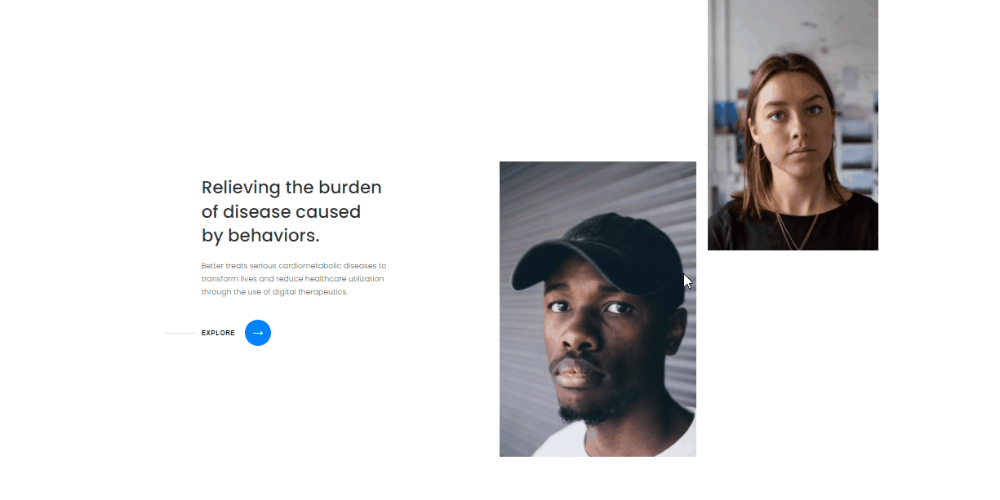

<h2 align="center">Hero Section with gsap Animations</h2>

<h4 align="center">
 <a href="#-features">💻 Features</a> •
 <a href="#-technologies-used">🛠 Technologies</a> • 
 <a href="#books-what-i-learn">:books: What I learn</a> 
 <a href="#-how-to-run-the-project">🔨 How to run the project</a> • 
 <a href="#star2-thanks">:star2: Thanks</a>
</h4>

<br>



<h2 align="center"> 
	<a href="https://hero-section-with-gsap.vercel.app/">View Site</a>
</h2>

## 💻 Features

- [x] Hero section with cool gsap animations

## 🛠 Technologies Used

- [React](https://reactjs.org/docs/getting-started.html)
- [Sass](https://sass-lang.com/documentation)
- [GSAP 2.0](https://greensock.com/docs/v2/GSAP)

## :books: What I learn

- How to make basics animations with gsap

## 🔨 How to run the project

```bash
# Clone this repository
$ git clone https://github.com/tl-lucasestevam/hero-section-with-gsap

# Access the project folder
$ cd hero-section-with-gsap

# Install the dependencies
$ yarn 

# Run the application in development mode
$ yarn start

```

## **:star2: Thanks!**

<div align=center>
  <table style="width:100%">
    <tr align=center>
      <td>
        <a href="https://www.youtube.com/channel/UCqrxiLP9RHz2GxDJaZuTRBw">
          
        </a>
        <p>
          Akram Khalid (Wrong Akram)
        </p>
      </td>
    </tr>
  </table>
</div>

<h4 align="center">
	Make with ❤️ by <a href="https://github.com/tl-lucasestevam">Lucas Estevam</a>
</h4>
